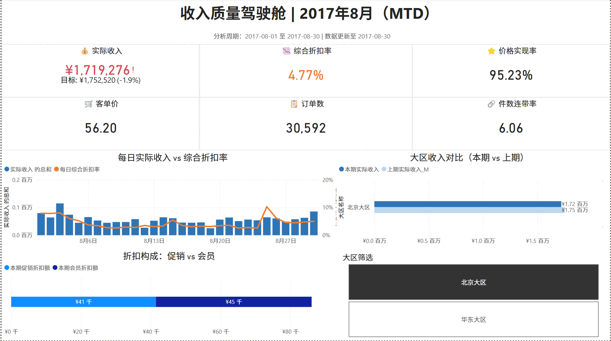
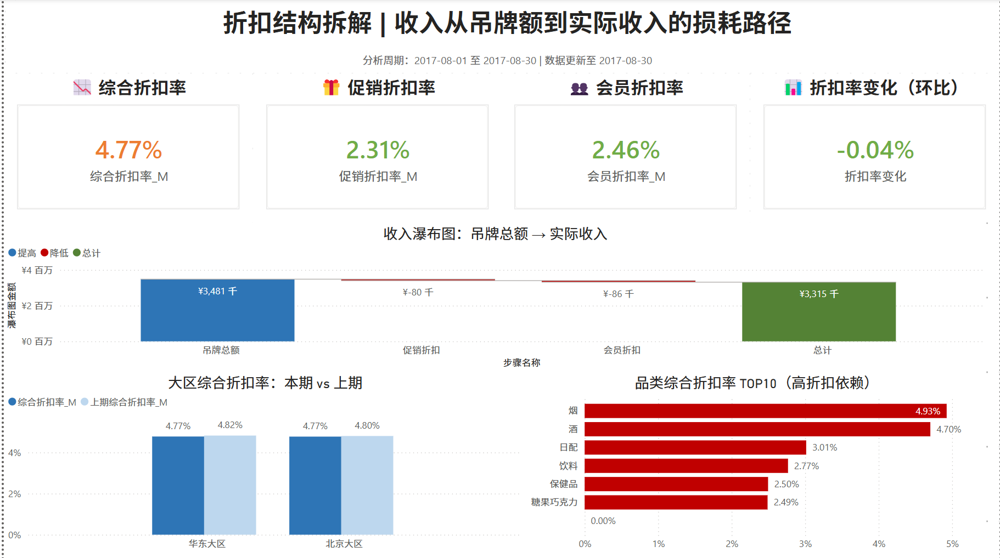
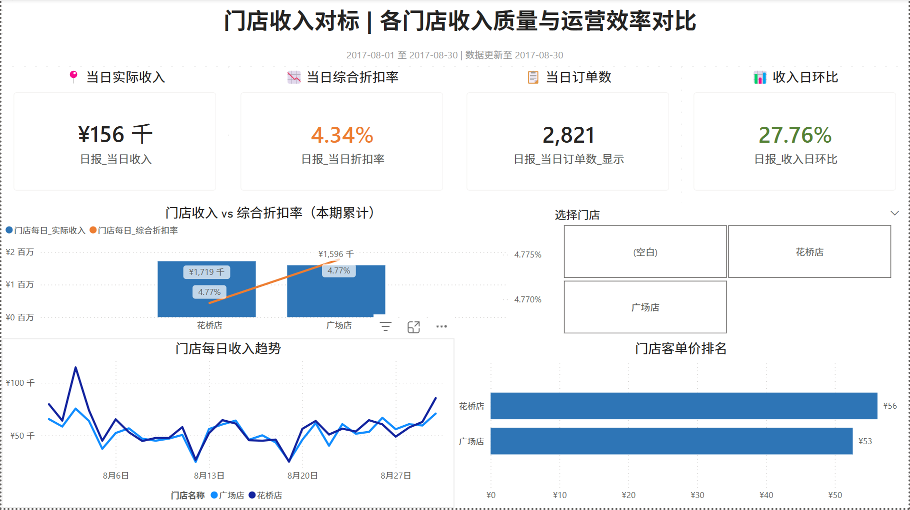
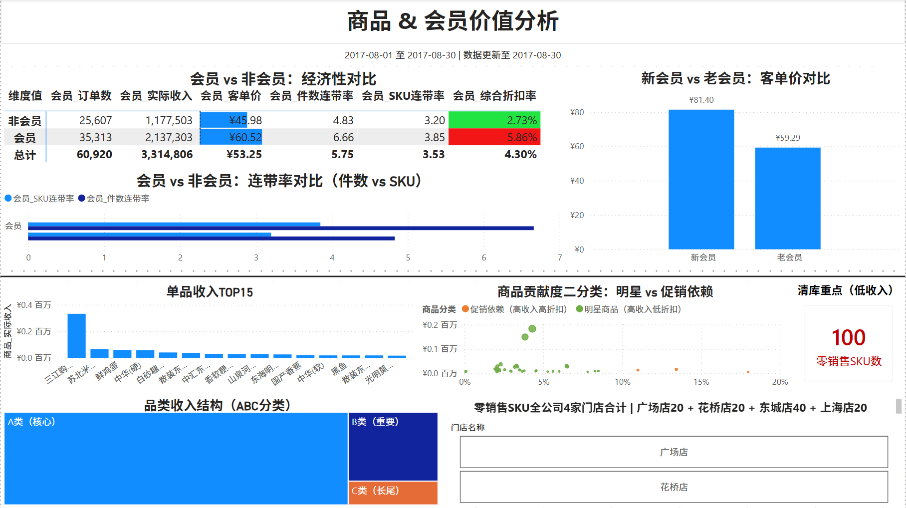

# 零售连锁企业收入质量分析与折扣管控可视化项目

> 基于 SQL + Power BI 的零售财务分析项目，构建"吊牌额→促销折扣→会员折扣→实际收入"四层收入结构模型，搭建 4 页可视化看板支撑收入质量监控与折扣策略决策。


---

## 📌 项目概览

模拟连锁零售企业的财务分析场景，基于销售订单、商品、会员、门店、品类等多源数据,通过 SQL 加工与 Power BI 可视化，建立一套覆盖**收入质量监控、折扣结构拆解、门店对标、商品&会员价值分析**的财务分析体系。

**核心视角**：跳出传统"销售额"单一指标，从**收入质量**与**折扣管理**双视角切入，更贴合财务 BP 的决策需求。

---

## 🎯 核心成果速览

### 看板预览

#### 页面1：收入质量驾驶舱


#### 页面2：折扣结构拆解（核心创新页）


#### 页面3：门店收入对标


#### 页面4:商品&会员价值分析


---

## 💡 关键发现与业务洞察

| 类别 | 发现 | 业务价值 |
|---|---|---|
| **数据治理** | POS 系统将营销优惠券（"苏泊尔压力锅优惠券"）记入销售明细，导致滞销榜单失真 | 通过商品维度过滤剥离非销售记录，避免运营基于错误数据决策 |
| **会员经济性** | 会员综合折扣率 5.86% 是非会员（2.73%）的 **2.14 倍**，但客单价仅高出 ¥14.5 | 揭示会员体系"高购买力+高让利"双高现象，支撑会员折扣力度评估 |
| **滞销识别** | 识别 100 个零销售 SKU（占商品池约 18%） | 为清库决策与品类调整提供量化依据 |
| **品类结构** | 烟、酒两个品类贡献全公司 80%+ 收入（A类核心） | 验证品类经营高度集中，识别 ABC 资源配置优先级 |

---

## 🛠️ 技术栈

- **数据加工**：SQL（MySQL，使用 CTE、窗口函数、CASE WHEN）
- **可视化**：Power BI Desktop（DAX 度量值、数据建模、条件格式）
- **核心技术点**：
  - MTD（Month-to-Date）同口径环比框架
  - 加权平均折扣率计算
  - 数据建模（一对多关系、独立维表设计）
  - 条件格式视觉预警（KPI 阈值变色）
  - 收入瀑布图、商品贡献度散点图等高级视觉对象

---

## 📂 仓库结构

```
.
├── README.md                       本文件，项目门面
├── 01_项目说明文档.md              项目详细文档（业务背景/分析框架/指标体系）
├── 02_SQL代码/                     6 段主题分析 SQL
│   ├── sql1_大区收入质量分析.sql
│   ├── sql2_门店每日明细.sql
│   ├── sql3_门店日报对比.sql
│   ├── sql4_商品贡献度分析.sql
│   ├── sql5_会员价值分析.sql
│   └── sql6_品类结构分析.sql
├── 03_数据集/                      原始数据 + SQL 输出结果
│   ├── 源数据_说明.md
│   ├── dim_*.csv                   维度表（商品、门店、会员、品类、日期）
│   ├── fct_*.csv                   事实表（订单头、订单明细）
│   └── 财务数据分析_sql*.csv       6 段 SQL 输出结果
├── 04_可视化看板/
│   ├── 财务数据分析_v1.pbix        Power BI 完整源文件（可下载交互体验）
│   └── 看板截图_PDF版.pdf          4 页看板合订 PDF
└── 05_看板截图_单页/                单页 PNG 图（用于 README 渲染）
    ├── 页面1_收入质量驾驶舱.png
    ├── 页面2_折扣结构拆解.png
    ├── 页面3_门店收入对标.png
    └── 页面4_商品会员价值分析.png
```

---

## 📊 指标体系

构建 4 大类、20+ 项核心财务指标：

- **收入端（5 项）**：吊牌总额、实际收入、促销折扣额、会员折扣额、折扣总额
- **折扣率（4 项）**：促销折扣率、会员折扣率、综合折扣率、价格实现率
- **客户经济性（4 项）**：客单价、件数连带率、SKU 连带率、会员渗透率
- **时间对比（多项）**：MTD 环比、日环比、上期对比指标

实现方式：25+ 个 DAX 度量值，详见 `04_可视化看板/财务数据分析_v1.pbix`

---

## 🚀 快速浏览

**如果你只有 30 秒**：直接看上面"看板预览"的 4 张截图

**如果你只有 5 分钟**：浏览本 README 完整内容

**如果你想深入了解**：阅读 [01_项目说明文档.md](01_项目说明文档.md)

**如果你想交互体验**：下载 [财务数据分析_v1.pbix](04_可视化看板/财务数据分析_v1.pbix)，需要 Power BI Desktop（免费，[微软官方下载](https://powerbi.microsoft.com/zh-cn/desktop/)）

---

## ⚠️ 数据说明

本项目使用的是**脱敏的模拟零售业务样本数据**，非真实企业数据。详见 [源数据_说明.md](03_数据集/源数据_说明.md)。

---

## 📮 联系方式

- **作者**：陶惠灵
- **邮箱**：thlthl2010@yeah.net
- **GitHub**：[@taohuiling2010-bot](https://github.com/taohuiling2010-bot)

如对项目有任何疑问或建议，欢迎通过 Issue 或邮件联系。
